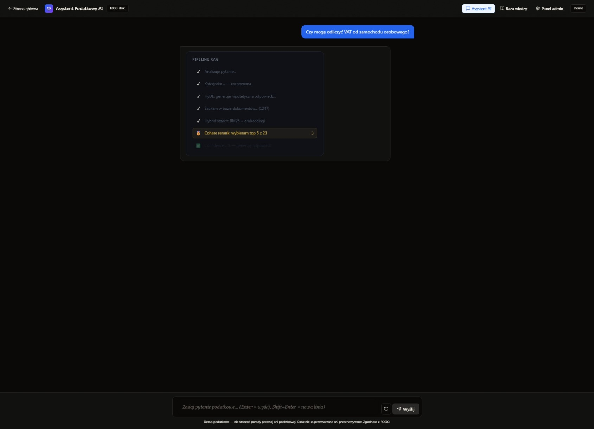
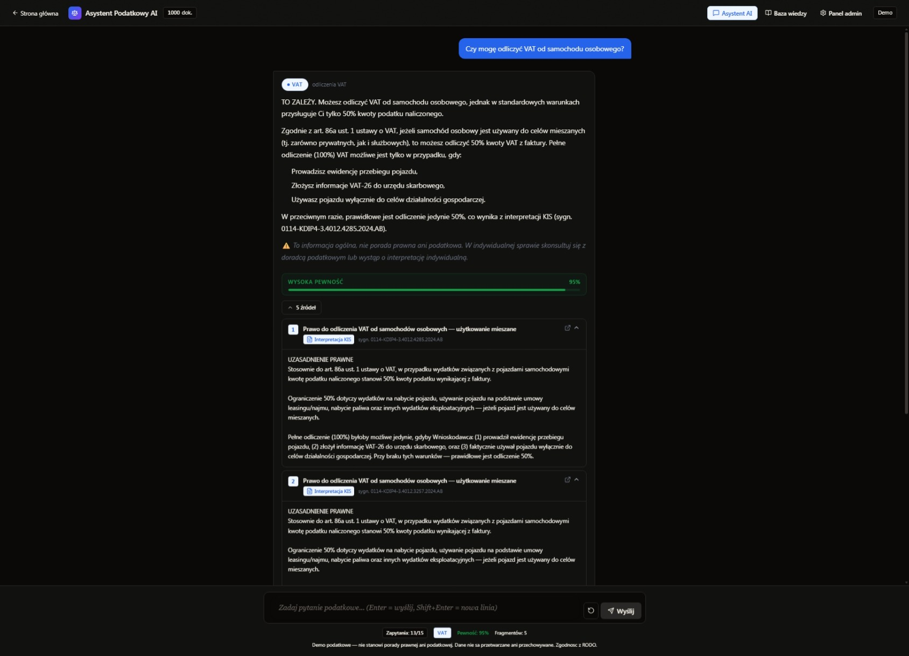
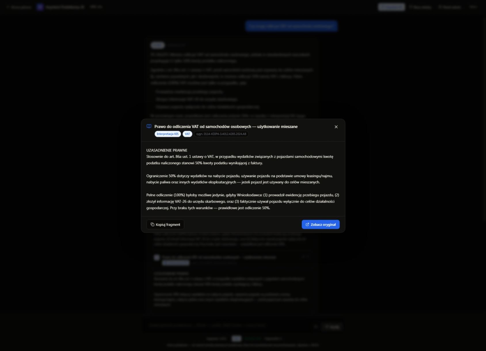
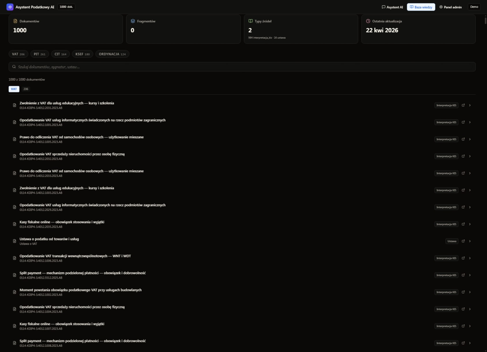

# Tax RAG

> RAG demo on Polish tax documents — query tax law in natural language, get answers with citations.

## What is it

Tax-RAG is a proof-of-concept Retrieval-Augmented Generation system built on Polish tax documents: KIS interpretations, ISAP legislative acts, parliamentary legislation, and Ministry of Finance documents. The user asks a question in Polish, the system performs semantic search across the document database and responds with precise citations and links to source documents.

The project demonstrates RAG architecture for law firms, accounting offices, and tax advisors considering deployment of AI assistants on internal document collections.

## Features

- **Semantic search** — Supabase pgvector embeddings with Cohere reranking for relevance
- **Inline citations** — every answer includes document numbers, articles, and links to source acts
- **Multi-source ingestion** — KIS interpretations, ISAP legal acts, Sejm RP, PDF documents
- **SSE streaming** — responses streamed token by token via Server-Sent Events
- **Generation** — Anthropic Claude Sonnet via OpenRouter
- **Knowledge base panel** — browse indexed documents, statuses, statistics
- **Dark/light mode** — responsive design
- **Admin panel** — knowledge base management, re-ingestion, analytics
- **DOCX/PDF export** — download answers as documents

## Stack

| Layer | Technology |
|-------|-----------|
| Frontend | Next.js, React, TypeScript, Tailwind CSS |
| Backend | Next.js API Routes, SSE streaming |
| AI | Anthropic Claude Sonnet via OpenRouter |
| RAG | Supabase pgvector + Cohere Rerank |
| Database | Supabase (PostgreSQL + pgvector) |
| Scraping | Cheerio (KIS, ISAP, Sejm) |
| PDF | pdf-parse, pdfjs-dist |
| Export | docx, file-saver |
| State | Zustand |
| Animations | Framer Motion |
| Deploy | Vercel |

## Status

Demo — [rag-demo-podatki.vercel.app](https://rag-demo-podatki.vercel.app)

---
Built by [Emil Piński](https://emilpinski.pl)

> Source code is private. [Contact for collaboration](mailto:emilpinskidev@gmail.com)

## Screenshots

