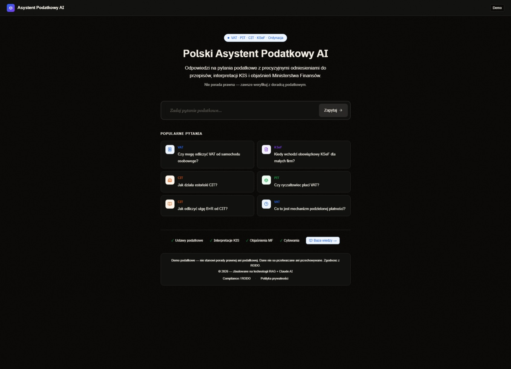

# tax-rag

> Demo RAG na polskich dokumentach podatkowych — pytaj o prawo podatkowe jak chatGPT, z cytatami i źródłami.



## Co to jest

Tax-RAG to proof-of-concept systemu Retrieval-Augmented Generation (RAG) zbudowanego na polskich dokumentach podatkowych: interpretacjach KIS, aktach ISAP, przepisach sejmowych i dokumentach MF. Użytkownik zadaje pytanie po polsku, system wyszukuje semantycznie w bazie dokumentów i odpowiada z precyzyjnymi cytatami i linkami do źródeł.

Projekt jest demonstracją technologii RAG dla firm prawnych, biur rachunkowych i doradców podatkowych, które chcą wdrożyć własnego asystenta AI na wewnętrznych dokumentach.

## Funkcje

- **Semantyczne wyszukiwanie** — embeddingi Supabase pgvector, reranking Cohere dla najlepszej trafności
- **Inline cytaty i źródła** — każda odpowiedź zawiera numery dokumentów, artykuły i linki do aktów
- **Wieloźródłowy ingestion** — scraper KIS (interpretacje), ISAP (akty prawne), Sejm RP, dokumenty PDF
- **Streaming SSE** — odpowiedzi streamowane token po tokenie przez Server-Sent Events
- **Claude AI** — Anthropic claude-sonnet jako model generujący odpowiedzi
- **Knowledge base panel** — przeglądanie zaindeksowanych dokumentów, statusy, statystyki
- **Dark/light mode** — next-themes, responsywny design
- **Admin panel** — zarządzanie bazą wiedzy, reingest, analityki
- **Export do DOCX/PDF** — pobieranie odpowiedzi jako dokumenty

## Stack

| Warstwa | Technologia |
|---------|-------------|
| Frontend | Next.js 16, React 19, TypeScript, Tailwind CSS |
| Backend | Next.js API Routes, SSE streaming |
| AI | Anthropic Claude (claude-sonnet) |
| RAG | Supabase pgvector + Cohere Rerank |
| Baza danych | Supabase (PostgreSQL + pgvector) |
| Scraping | Cheerio (KIS, ISAP, Sejm) |
| PDF | pdf-parse, pdfjs-dist |
| Export | docx, file-saver |
| State | Zustand |
| Animacje | Framer Motion |
| Deploy | Vercel |

## Uruchomienie

```bash
git clone https://github.com/emilpinski/tax-rag
cd tax-rag
npm install
cp .env.example .env.local
# Uzupelnij zmienne srodowiskowe
npm run dev

# Ingestion dokumentow:
npm run ingest
npm run scrape:kis
npm run scrape:isap
npm run scrape:sejm
```

## Zmienne środowiskowe

| Zmienna | Opis | Wymagana |
|---------|------|----------|
| `NEXT_PUBLIC_SUPABASE_URL` | URL projektu Supabase | ✅ |
| `NEXT_PUBLIC_SUPABASE_ANON_KEY` | Klucz publiczny Supabase | ✅ |
| `SUPABASE_SERVICE_ROLE_KEY` | Klucz serwisowy (ingestion) | ✅ |
| `ANTHROPIC_API_KEY` | Klucz API Claude AI | ✅ |
| `COHERE_API_KEY` | Klucz Cohere (reranking) | ✅ |

## Status

Demo — [tax-rag.vercel.app](https://tax-rag.vercel.app)

---
Built by [Emil Piński](https://emilpinski.pl)
